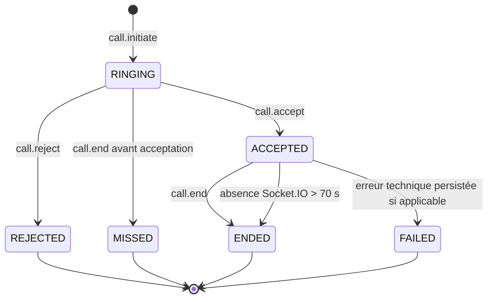

# Architecture, sécurité et validation des appels LiveKit/WebRTC

## 1. Objet du document

Ce document décrit l'implémentation actuelle des appels vocaux et vidéo de Jokko, les responsabilités du frontend Angular, du backend NestJS, de Socket.IO et de LiveKit Cloud, ainsi que les protections ajoutées avant la mise en production.

Il constitue la référence technique du module d'appel. Il ne présente pas une architecture théorique : les chemins, contrats, états, règles de sécurité et résultats de tests décrits ici correspondent au code actuellement présent dans le dépôt.

Le périmètre est exclusivement la version Web :

- Angular et TypeScript côté navigateur ;
- NestJS et Socket.IO côté serveur ;
- LiveKit Web SDK et LiveKit Cloud pour le transport WebRTC ;
- PostgreSQL et Prisma pour l'état métier et l'historique des appels.

## 2. Résumé exécutif

L'architecture sépare volontairement la signalisation métier du transport média.

Socket.IO ne transporte ni audio ni vidéo. Il orchestre les actions métier telles que l'initiation, l'acceptation, le refus, la fin d'appel et la synchronisation multi-onglet. LiveKit transporte ensuite les pistes audio et vidéo dans une room dédiée, après délivrance d'un jeton court généré par le backend.

```text
Angular
  |-- HTTP/JWT -------> NestJS -------> PostgreSQL/Prisma
  |-- Socket.IO ------> CallsGateway -> CallsService
  `-- WebRTC ---------> LiveKit Cloud
```

Cette séparation évite de confier au navigateur des décisions de sécurité. Le navigateur demande une action ; le backend vérifie la conversation, les participants, le statut et le type enregistré en base avant d'autoriser l'accès à une room.

## 3. Organisation du code

### 3.1 Backend

Le module suit l'organisation modulaire du projet :

```text
backend/src/calls/
  application/
    ports/
      calls-repository.port.ts
      media-room-provider.port.ts
    services/
      calls.service.ts
      calls.service.spec.ts
  domain/
    call.types.ts
  infrastructure/
    calls.repository.ts
    calls.repository.spec.ts
    livekit-media-room.adapter.ts
  presentation/
    call-signal.dto.ts
    calls.controller.ts
    calls.gateway.ts
  calls.module.ts
```

La couche `presentation` expose HTTP et Socket.IO. La couche `application` porte les règles d'orchestration. La couche `infrastructure` contient Prisma et l'adaptateur LiveKit. Le domaine conserve les contrats indépendants des frameworks.

### 3.2 Frontend Web Angular

```text
frontend_web_angular/src/app/features/calls/
  application/
    call-facade.service.ts
  data-access/
    calls-api.service.ts
    calls-realtime.service.ts
  domain/
    call.models.ts
  infrastructure/
    call-audio.service.ts
  presentation/
    call-overlay.component.*
    call-media-track.directive.ts
```

`CallFacade` est le point d'orchestration du frontend. Les composants ne créent pas directement une `Room`, ne construisent pas de JWT LiveKit et n'émettent pas eux-mêmes des événements Socket.IO critiques. Cette centralisation réduit le couplage et garantit un nettoyage identique sur toutes les pages.

## 4. Modèle persistant

Le modèle Prisma `Appel` conserve :

- l'identifiant UUID de l'appel ;
- la conversation concernée ;
- l'appelant et le destinataire ;
- le type vocal ou vidéo ;
- le statut métier ;
- les dates de sonnerie, d'acceptation et de fin ;
- la date d'expiration ;
- les dates de création et de mise à jour.

Les statuts persistés sont :

| Statut Prisma | État applicatif | Signification                                                        |
| ------------- | --------------- | -------------------------------------------------------------------- |
| `SONNE`       | `RINGING`       | L'appel attend une réponse                                           |
| `ACCEPTE`     | `ACCEPTED`      | Les participants sont autorisés à rejoindre LiveKit                  |
| `REFUSE`      | `REJECTED`      | Le destinataire a refusé                                             |
| `TERMINE`     | `ENDED`         | Un participant a raccroché ou le nettoyage serveur a terminé l'appel |
| `MANQUE`      | `MISSED`        | L'appel a pris fin avant acceptation                                 |
| `ECHEC`       | `FAILED`        | L'appel a échoué techniquement                                       |

L'historique n'est donc pas déduit de l'interface. Il provient de l'état persistant et reste cohérent après une actualisation ou une nouvelle connexion.

## 5. Cycle métier d'un appel



### 5.1 Initiation

Le frontend crée un `callId` UUID et émet `call.initiate` avec le strict minimum :

```ts
{
  callId: string;
  conversationId: string;
  kind: 'VOICE' | 'VIDEO';
}
```

Le backend vérifie que l'utilisateur est actif, qu'il appartient à la conversation et que le destinataire est disponible. Il calcule lui-même les identifiants de l'appelant et du destinataire à partir de la conversation.

La création s'effectue dans une transaction Prisma sérialisable. Avant l'insertion, le repository recherche tout appel `SONNE` ou `ACCEPTE` concernant l'un des deux participants. Cette règle empêche plusieurs appels actifs simultanés pour un même utilisateur.

### 5.2 Acceptation

Seul le destinataire enregistré peut accepter. Le passage de `RINGING` vers `ACCEPTED` est atomique. Une deuxième acceptation, provenant par exemple d'un autre onglet, ne peut pas créer un second état valide.

Après l'acceptation, le backend émet :

- `call.accepted` vers l'appelant ;
- `call.answered-elsewhere` vers les autres sockets du destinataire.

Les autres onglets arrêtent immédiatement leur sonnerie et ferment leur overlay sans créer de Room LiveKit.

### 5.3 Refus et fin

`call.reject` est réservé au destinataire pendant la sonnerie. `call.end` est accepté pour l'un des deux participants et termine l'appel de manière atomique.

Si `call.end` intervient avant l'acceptation, l'appel est enregistré comme manqué. Après acceptation, il est enregistré comme terminé.

## 6. Contrats Socket.IO

Le namespace utilisé est `/calls`. Le JWT d'accès est transmis dans `handshake.auth.token`. Un socket sans jeton valide ou rattaché à un compte désactivé est immédiatement déconnecté.

### 6.1 Événements entrants

- `call.initiate`
- `call.accept`
- `call.reject`
- `call.end`

Tous les payloads passent par `CallSignalDto`, `class-validator` et un `ValidationPipe` strict :

- `callId` doit être un UUID ;
- `conversationId` doit être un UUID ;
- `kind` doit valoir `VOICE` ou `VIDEO` ;
- les propriétés supplémentaires sont refusées.

### 6.2 Événements sortants

- `call.incoming`
- `call.accepted`
- `call.rejected`
- `call.ended`
- `call.missed`
- `call.answered-elsewhere`

### 6.3 Acquittements, timeout et reprise

Les quatre actions critiques utilisent un acquittement Socket.IO. Le frontend ne considère pas une action confirmée avant la réponse positive du serveur. Un timeout et une reprise contrôlée protègent les pertes temporaires de signalisation.

L'idempotence est importante : une nouvelle tentative portant le même `callId` ne doit pas créer un second appel. Une transition déjà appliquée est reconnue comme telle, tandis qu'une transition contradictoire est refusée.

## 7. API HTTP

Toutes les routes sont protégées par `JwtAuthGuard` et préfixées par `/api/v1`.

### 7.1 Historique

```http
GET /api/v1/calls/history?limit=50&offset=0
```

La réponse contient les appels entrants et sortants, leur statut, le correspondant, le type et les dates utiles.

### 7.2 Appel actif

```http
GET /api/v1/calls/active
```

Cette route permet la resynchronisation après reconnexion Socket.IO, reconnexion LiveKit ou actualisation. Elle retourne l'appel actif de l'utilisateur ou `null`.

### 7.3 Jeton de room

```http
POST /api/v1/calls/conversations/:conversationId/join-credential
Content-Type: application/json

{
  "callId": "uuid"
}
```

Le serveur vérifie l'appel avant de générer le jeton. Le nom de room suit le format `jokko-call-<callId>` et n'est jamais accepté depuis le navigateur.

## 8. Sécurité LiveKit

Les variables sensibles restent exclusivement dans NestJS :

- `LIVEKIT_URL`
- `LIVEKIT_API_KEY`
- `LIVEKIT_API_SECRET`

Le secret API ne doit jamais apparaître dans Angular, dans un bundle JavaScript, dans `localStorage` ou dans une réponse autre que le JWT temporaire destiné à l'utilisateur courant.

Le jeton LiveKit possède une durée de vie de trois minutes. Cette durée limite la possibilité de réutiliser un jeton intercepté. Une fois connecté, la session WebRTC peut continuer au-delà de cette durée ; la durée courte protège principalement l'entrée dans la room.

Les grants sont calculés depuis le type persisté :

- appel vocal : publication microphone uniquement ;
- appel vidéo : publication caméra et microphone ;
- abonnement aux pistes autorisé ;
- publication de données LiveKit désactivée.

Le type final ne provient jamais de la confiance accordée au client. Un changement frauduleux `VOICE` vers `VIDEO`, une conversation différente ou un `callId` qui n'appartient pas à l'utilisateur est refusé.

En production, la validation d'environnement arrête le démarrage si la configuration LiveKit obligatoire est absente. En environnement non configuré, l'API renvoie une indisponibilité explicite au lieu de fabriquer un jeton invalide.

## 9. Connexion et reconnexion LiveKit

Le frontend traite les événements principaux :

- `SignalReconnecting` ;
- `Reconnecting` ;
- `Reconnected` ;
- `ParticipantDisconnected` ;
- `ParticipantConnected` ;
- `Disconnected`.

L'overlay affiche un état de reconnexion au lieu de masquer brutalement l'appel. Après `Reconnected`, `CallFacade` interroge de nouveau `GET /calls/active` afin de comparer l'état LiveKit avec l'état métier.

Une reconnexion Socket.IO déclenche également cette resynchronisation. Le serveur reste la source de vérité : l'interface ne reconstruit pas un appel à partir d'un ancien état local non confirmé.

## 10. Nettoyage des ressources média

La destruction d'une room couvre :

- tous les listeners de la `Room` ;
- les tracks locales ;
- la dépublication des tracks locales ;
- les éléments attachés aux tracks distantes ;
- la déconnexion complète de la Room ;
- les références Angular et les timers d'interface.

Le même chemin de nettoyage est utilisé après un raccrochage, une erreur de connexion, une erreur caméra, une erreur microphone, une publication impossible ou la destruction de l'interface.

### 10.1 Directive d'attachement média

`CallMediaTrackDirective` possède chaque élément audio ou vidéo qu'elle attache. Lorsqu'une track change ou que la directive est détruite, elle détache précisément son élément, retire sa référence DOM et vide son hôte.

Cette responsabilité dédiée corrige un défaut où Angular pouvait réconcilier le DOM après `track.attach()` et retirer les vidéos alors que les tracks WebRTC étaient bien actives. Elle évite également de dupliquer la logique d'attachement entre la vidéo locale, la vidéo distante et l'audio distant.

### 10.2 Fin inattendue d'une track locale

`CallFacade` écoute `TrackEvent.Ended` sur le microphone et la caméra. Si une permission est retirée ou si un périphérique disparaît :

- la track est dépubliée ;
- la caméra locale passe à l'état désactivé ;
- le correspondant reçoit la disparition de la track et ne conserve pas d'image figée ;
- le microphone est marqué muet s'il disparaît ;
- un message utilisateur explicite est affiché ;
- l'appel reste contrôlable et peut être terminé normalement.

## 11. Audio navigateur et périphériques

La création du microphone demande :

```ts
{
  echoCancellation: true,
  noiseSuppression: true,
  autoGainControl: true,
  channelCount: 1,
}
```

Le frontend traite le blocage de lecture automatique avec `AudioPlaybackStatusChanged`. Si le navigateur refuse de démarrer l'audio sans geste utilisateur, l'overlay présente un bouton `Activer le son`, qui appelle `room.startAudio()`.

Les événements de changement et d'erreur des périphériques rafraîchissent la liste disponible. Un échec de changement conserve le périphérique précédent et affiche une erreur au lieu de laisser l'interface dans un état incohérent.

## 12. Caméra distante et image figée

Les événements `TrackMuted`, `TrackUnmuted` et `TrackUnsubscribed` sont reflétés dans les signaux Angular.

Une piste vidéo muette ou terminée est retirée de la zone distante. L'interface affiche alors l'état `Caméra pas activée`. La dernière image vidéo ne reste pas affichée comme si la caméra fonctionnait encore.

## 13. Multi-onglet et plusieurs navigateurs

Chaque utilisateur rejoint la room Socket.IO `user:<userId>`. Cette room regroupe ses onglets et navigateurs connectés.

Lorsqu'un onglet accepte :

1. la transition atomique en base autorise une seule acceptation ;
2. l'appelant reçoit `call.accepted` ;
3. les autres sockets du destinataire reçoivent `call.answered-elsewhere` ;
4. les autres sonneries s'arrêtent ;
5. les autres overlays se ferment sans créer de PeerConnection.

La fermeture d'un onglet secondaire ne termine pas l'appel lorsqu'une autre connexion du même utilisateur reste présente.

## 14. Fermeture brutale et délai de grâce

Un navigateur peut disparaître sans émettre `call.end` : fermeture de l'onglet, arrêt du navigateur, crash du processus ou extinction de la machine. Sans traitement serveur, l'appel resterait `ACCEPTED` en base et bloquerait tout nouvel appel.

`CallsGateway` planifie désormais un nettoyage après une déconnexion Socket.IO. Le délai de grâce est de 70 secondes, volontairement supérieur au scénario de coupure réseau de 60 secondes.

À l'expiration :

1. le serveur vérifie de nouveau la room `user:<userId>` ;
2. si au moins un socket existe, aucune action n'est effectuée ;
3. si l'utilisateur est toujours totalement absent, le service recherche son appel actif ;
4. la transition vers l'état terminal est réalisée atomiquement ;
5. `call.ended` est envoyé aux sockets encore disponibles de l'autre participant.

Une reconnexion annule le timer. Cette règle protège simultanément les coupures temporaires et le multi-onglet.

### Limite de déploiement horizontal

La vérification `fetchSockets()` est cohérente sur une instance NestJS unique. Si plusieurs instances backend sont déployées, l'adaptateur Socket.IO doit être partagé, par exemple avec Redis, afin que la room utilisateur soit visible par toutes les instances. Sans adaptateur distribué, aucun système multi-instance fondé sur les rooms Socket.IO ne peut garantir une présence globale correcte.

## 15. Historique et présentation dans la discussion

Les appels sont présentés comme des événements de conversation et non dans une page d'historique séparée. L'affichage distingue :

- appel entrant ;
- appel sortant ;
- appel refusé ;
- appel terminé ;
- appel manqué.

La direction provient de la comparaison entre l'utilisateur courant, `callerId` et `recipientId`. Le statut vient de PostgreSQL. L'interface ne doit pas déduire un appel manqué uniquement à partir de la durée locale ou de la disparition de l'overlay.

## 16. Campagne de tests exécutée

### 16.1 Répétition et absence de fuite

Deux campagnes réelles ont été exécutées avec deux comptes authentifiés :

| Campagne                    | Résultat      | Durée observée      |
| --------------------------- | ------------- | ------------------- |
| 50 appels vidéo successifs  | 50/50 réussis | environ 7,1 minutes |
| 50 appels vocaux successifs | 50/50 réussis | environ 6,7 minutes |

Après chaque appel, et non uniquement après le dernier, le banc vérifie :

- aucune `RTCPeerConnection` active ;
- aucun `MediaStreamTrack` vivant ;
- aucun élément `<audio>` ou `<video>` résiduel ;
- aucun WebSocket LiveKit résiduel ;
- retour au nombre initial de WebSockets Socket.IO.

Le résultat observé est zéro ressource média résiduelle après chacun des cent appels.

### 16.2 Permissions

Les scénarios suivants sont validés :

- caméra refusée ;
- microphone refusé ;
- caméra et microphone refusés ;
- caméra et microphone retirés pendant un appel actif.

Les refus affichent un message compréhensible, ne provoquent aucune erreur Angular et exécutent le nettoyage. La révocation en cours d'appel retire correctement l'image distante au lieu de la figer.

### 16.3 Multi-onglet

Le scénario utilise deux onglets Chrome et une session Edge pour le même utilisateur, plus un navigateur pour le correspondant.

Une seule acceptation crée une Room. Les deux autres interfaces ferment leur appel et conservent zéro PeerConnection. Après fermeture des deux sessions secondaires et une attente de 75 secondes, l'appel reste actif grâce à l'onglet accepté encore connecté.

### 16.4 Crash navigateur

Le processus Chrome est volontairement crashé via le protocole DevTools, puis l'autre navigateur est fermé. Après 80 secondes, `GET /calls/active` retourne `null`. Cette preuve valide le nettoyage serveur au-delà du délai de grâce.

### 16.5 Qualité WebRTC observée

`RTCPeerConnection.getStats()` a été utilisé pour lire les rapports candidats et RTP. Pendant la campagne locale via LiveKit Cloud, les valeurs suivantes ont été observées :

| Profil navigateur   |    RTT | Jitter | Paquets perdus |
| ------------------- | -----: | -----: | -------------: |
| Wi-Fi simulé        | 140 ms |   2 ms |              0 |
| 4G simulée          | 143 ms |   4 ms |              0 |
| Retour Wi-Fi simulé | 142 ms |   3 ms |              0 |
| Fast 3G simulée     | 142 ms |   3 ms |              0 |
| Slow 3G simulée     | 141 ms |   3 ms |              0 |

Ces chiffres démontrent la continuité de l'appel pendant les changements de profil du navigateur. Ils ne démontrent pas une véritable limitation RTP en 3G : Chrome DevTools limite principalement HTTP et WebSocket, mais ne reproduit pas fidèlement la perte, le jitter et le débit UDP d'un réseau mobile réel.

## 17. Tests réseau physiques restant à exécuter

Le banc contient un scénario opt-in qui ajoute une règle temporaire du pare-feu Windows ciblant uniquement Chrome. Cette méthode coupe réellement le trafic du navigateur client tout en laissant Edge et le backend accessibles.

Le test couvre successivement 10, 30 et 60 secondes, puis vérifie :

- apparition de l'état `Reconnexion en cours` ;
- disparition de cet état après restauration ;
- présence des deux vidéos ;
- maintien de l'appel ;
- possibilité de raccrocher normalement.

Il doit être lancé depuis un PowerShell administrateur :

```powershell
cd frontend_web_angular
$env:E2E_BASE_URL = "http://127.0.0.1:4201"
$env:JOKKO_CALL_CLIENT_IDENTIFIER = "<compte-client-de-test>"
$env:JOKKO_CALL_CLIENT_PASSWORD = "<mot-de-passe-client>"
$env:JOKKO_CALL_PROVIDER_IDENTIFIER = "<compte-prestataire-de-test>"
$env:JOKKO_CALL_PROVIDER_PASSWORD = "<mot-de-passe-prestataire>"
$env:JOKKO_CALL_CONVERSATION_ID = "<uuid-conversation>"
$env:JOKKO_OS_NETWORK_TEST = "1"
npx.cmd playwright test e2e/calls-resilience.spec.ts --project=edge-desktop --grep "10, 30 and 60" --reporter=line
```

La règle est supprimée avant le test et dans le bloc `finally`. Le test reste désactivé sans `JOKKO_OS_NETWORK_TEST=1` afin qu'une exécution E2E normale ne modifie jamais le pare-feu.

Un vrai basculement Wi-Fi vers 4G nécessite deux interfaces réseau actives. Il ne peut pas être remplacé honnêtement par une simple émulation DevTools.

## 18. Commandes de vérification

### Backend

```powershell
cd backend
npm.cmd run build
npx.cmd eslint src/calls/application/services/calls.service.ts src/calls/application/services/calls.service.spec.ts src/calls/presentation/calls.gateway.ts
npm.cmd test -- --runInBand src/calls/application/services/calls.service.spec.ts src/calls/infrastructure/calls.repository.spec.ts
```

### Frontend

```powershell
cd frontend_web_angular
npm.cmd run quality
npm.cmd run build
```

### Cycle répété

Le fichier `e2e/calls-livekit-lifecycle.spec.ts` accepte :

- `JOKKO_CALL_KIND=VOICE` ou `VIDEO` ;
- `JOKKO_CALL_CYCLES=50` ;
- les identifiants de test via variables d'environnement.

Les secrets ne doivent jamais être écrits directement dans le fichier de test ou ajoutés au dépôt Git.

## 19. Diagnostic des erreurs courantes

### `EADDRINUSE :::3000`

Cette erreur signifie qu'un autre processus écoute déjà sur le port du backend. Elle ne vient ni de LiveKit ni de NestJS.

```powershell
netstat -ano | Select-String ':3000\s+.*LISTENING'
Get-Process -Id <PID>
Stop-Process -Id <PID> -Force
```

Il faut toujours vérifier le processus avant de l'arrêter.

### `503 Service Unavailable` sur `join-credential`

Vérifier la présence de `LIVEKIT_URL`, `LIVEKIT_API_KEY` et `LIVEKIT_API_SECRET` dans l'environnement du backend, puis redémarrer NestJS. Une modification du fichier `.env` n'est pas automatiquement appliquée à un processus déjà lancé.

### Appel actif mais vidéo absente

Vérifier successivement :

1. le statut `ACCEPTED` via `/calls/active` ;
2. la réussite de `join-credential` ;
3. les permissions du navigateur ;
4. la présence de tracks publiées dans les logs LiveKit ;
5. la présence des éléments vidéo gérés par `CallMediaTrackDirective`.

### Appel suivant refusé comme occupé

Interroger `/calls/active`. Si un crash vient de se produire, attendre la fin du délai de grâce serveur. Après 70 secondes d'absence totale, l'appel doit disparaître. S'il reste actif, contrôler les logs `CallsGateway` et la visibilité des sockets sur toutes les instances backend.

## 20. Checklist de mise en production

Avant chaque déploiement :

- vérifier HTTPS/WSS sur les domaines frontend, backend et LiveKit ;
- confirmer que les secrets LiveKit sont uniquement côté backend ;
- contrôler les origines CORS HTTP et Socket.IO ;
- exécuter les tests vocaux et vidéo ciblés ;
- vérifier qu'aucun appel de test n'est actif en base ;
- exécuter au moins une coupure réseau physique ;
- contrôler le fonctionnement des permissions sur Chrome et Edge réels ;
- confirmer la stratégie Socket.IO distribuée avant de déployer plusieurs instances ;
- surveiller les erreurs `call.initiate failed` et les échecs de nettoyage ;
- changer immédiatement tout identifiant de test exposé hors du gestionnaire de secrets.

## 21. État de préparation

Le système est validé pour les appels normaux, les répétitions intensives, le nettoyage WebRTC, les refus de permissions, la disparition des périphériques, le multi-onglet et le crash complet des navigateurs.

La validation finale d'une résilience réseau mobile réelle reste une opération d'infrastructure. Elle doit être exécutée avec un pare-feu administrateur ou un outil réseau dédié, puis avec une véritable interface 4G. Cette distinction est importante : une simulation DevTools ne doit jamais être présentée comme une preuve de comportement UDP réel.
