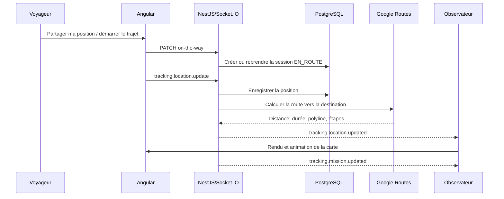

# Cartographie Google Maps et suivi GPS en temps réel

## 1. Objet du document

Ce document constitue la référence technique du système de cartographie de Jokko. Il décrit la configuration Google Maps, le géocodage, le calcul d’itinéraires, le chargement de la carte Angular et le suivi GPS temps réel associé aux réservations.

La cartographie ne doit pas être considérée comme une simple vue graphique. Elle relie plusieurs responsabilités : traduction des adresses en coordonnées, calcul d’une route routière, acquisition GPS sur le navigateur, persistance des positions, synchronisation Socket.IO, calcul de l’heure estimée d’arrivée et restitution cohérente aux deux participants.

Le périmètre documenté couvre uniquement l’implémentation Web Angular et le backend NestJS actuellement présents.

## 2. Architecture générale

```text
Navigateur Angular
  ├─ Google Maps JavaScript API
  ├─ Geolocation API / DeviceOrientation API
  ├─ HTTP /api/v1/maps/*
  ├─ HTTP /api/v1/reservations/*/live-tracking
  └─ Socket.IO /socket
             │
             ▼
Backend NestJS
  ├─ MapsModule
  ├─ GeolocationModule
  ├─ RoutingModule
  ├─ LiveTrackingModule
  ├─ GoogleMapsApiClient
  └─ LiveTrackingRepository / Prisma
             │
             ▼
Services Google Cloud
  ├─ Geocoding API
  ├─ Routes API v2
  ├─ Maps JavaScript API
  ├─ Places API
  └─ Map ID / Advanced Markers
```

La séparation des modules respecte les responsabilités suivantes :

| Module                      | Responsabilité                                                               |
| --------------------------- | ---------------------------------------------------------------------------- |
| `maps`                      | Façade HTTP, modèles cartographiques et configuration publique du navigateur |
| `geolocation`               | Conversion adresse vers coordonnées et coordonnées vers adresse              |
| `routing`                   | Calcul des itinéraires à travers un port indépendant du fournisseur          |
| `live-tracking`             | Cycle métier d’une mission, positions, présence et diffusion temps réel      |
| Angular `shared/maps`       | Chargement unique du SDK Google et appels HTTP cartographiques               |
| Angular `features/tracking` | GPS, Socket.IO, état de suivi et rendu animé de la carte                     |

Le domaine ne dépend directement ni de Google Maps, ni de Socket.IO, ni du DOM. Les dépendances externes sont concentrées dans les couches infrastructure et présentation.

## 3. Arborescence principale

```text
backend/src/
  maps/
    application/maps-public-config.service.ts
    domain/models/map-route.model.ts
    domain/value-objects/geo-coordinate.value-object.ts
    infrastructure/google/google-maps-api.client.ts
    presentation/dto/maps.dto.ts
    presentation/maps.controller.ts
  geolocation/
    application/use-cases/geocode-address.use-case.ts
    application/use-cases/reverse-geocode.use-case.ts
  routing/
    application/use-cases/compute-routes.use-case.ts
  live-tracking/
    domain/entities/
    domain/events/
    application/services/
    infrastructure/repositories/live-tracking.repository.ts
    presentation/controllers/live-tracking.controller.ts
    presentation/gateways/live-tracking.gateway.ts

frontend_web_angular/src/app/
  shared/maps/google-maps-loader.service.ts
  features/tracking/data-access/provider-location.service.ts
  features/tracking/data-access/tracking-realtime.service.ts
  features/tracking/state/
  features/tracking/presentation/tracking-google-map-renderer.service.ts
```

## 4. Configuration Google Cloud

### 4.1 Variables d’environnement backend

```env
# Clé privée du serveur. Geocoding API et Routes API uniquement.
GOOGLE_MAPS_API_KEY=

# Clé publique utilisée par Maps JavaScript API dans Angular.
GOOGLE_MAPS_BROWSER_API_KEY=

# Identifiant du style Google Cloud utilisé par les marqueurs avancés.
GOOGLE_MAPS_MAP_ID=
```

`GOOGLE_MAPS_API_KEY` ne doit jamais être renvoyée au navigateur. Elle est lue exclusivement par `GoogleMapsApiClient`. En production, la clé doit être limitée côté Google Cloud aux API Geocoding et Routes ainsi qu’aux adresses IP ou au service d’exécution autorisé.

`GOOGLE_MAPS_BROWSER_API_KEY` est nécessaire au chargement de Maps JavaScript dans Angular. Son exposition dans le navigateur est normale, mais elle doit être restreinte aux domaines Jokko autorisés et uniquement aux API Maps JavaScript et Places.

`GOOGLE_MAPS_MAP_ID` sélectionne le style de carte et autorise les fonctionnalités de marqueurs avancés. `DEMO_MAP_ID` est seulement un repli de développement.

### 4.2 Comportement par environnement

- En production, la clé navigateur doit être distincte de la clé serveur.
- En développement, `MapsPublicConfigService` peut utiliser `GOOGLE_MAPS_API_KEY` comme repli si la clé navigateur est vide.
- Ce repli ne s’applique jamais lorsque `NODE_ENV=production`.
- La langue publique est `fr` et la région fonctionnelle est le Sénégal (`SN`).

### 4.3 APIs Google nécessaires

- Maps JavaScript API ;
- Places API ;
- Geocoding API ;
- Routes API ;
- Map Management pour le Map ID.

## 5. API HTTP cartographique

Les chemins ci-dessous sont préfixés par `/api/v1` dans l’application.

### 5.1 Configuration publique

```http
GET /api/v1/maps/config
```

Cette route est publique. Elle retourne uniquement les informations nécessaires au navigateur :

```json
{
  "success": true,
  "message": "Configuration Google Maps recuperee.",
  "data": {
    "browserApiKey": "cle-publique-restreinte",
    "mapId": "identifiant-map-id",
    "countryCode": "SN",
    "language": "fr"
  }
}
```

La réponse peut être mise en cache côté Angular. Aucun secret serveur ne doit y apparaître.

### 5.2 Géocodage d’une adresse

```http
GET /api/v1/maps/geocode?address=Ouakam%2C%20Dakar
Authorization: Bearer <access-token>
```

Le backend ajoute le contexte `Senegal` et le filtre `country:SN`. Une réponse valide possède la forme suivante :

```json
{
  "latitude": 14.723,
  "longitude": -17.489,
  "formattedAddress": "Ouakam, Dakar, Sénégal",
  "placeId": "google-place-id"
}
```

Une adresse vide ou invalide produit `MAPS_ADDRESS_INVALID`. Aucun résultat Google exploitable produit `null` dans `data`, sans fabriquer de coordonnées par défaut.

### 5.3 Géocodage inverse

```http
GET /api/v1/maps/reverse-geocode?latitude=14.716677&longitude=-17.467686
Authorization: Bearer <access-token>
```

Les contraintes sont : latitude entre `-90` et `90`, longitude entre `-180` et `180`. Le résultat privilégie une adresse lisible en combinant rue, quartier, commune, ville et pays sans répéter les composants.

### 5.4 Calcul d’itinéraires

```http
POST /api/v1/maps/routes
Authorization: Bearer <access-token>
Content-Type: application/json

{
  "origin": { "latitude": 14.716677, "longitude": -17.467686 },
  "destination": { "latitude": 14.7392, "longitude": -17.4921 },
  "alternatives": false
}
```

Google Routes v2 est appelé avec :

- `travelMode: DRIVE` ;
- `routingPreference: TRAFFIC_AWARE` ;
- unités métriques ;
- instructions en français ;
- alternatives activées uniquement si le client le demande.

Exemple de route normalisée :

```json
{
  "id": "route-0",
  "distanceMeters": 5340,
  "durationSeconds": 780,
  "encodedPolyline": "...",
  "coordinates": [
    { "latitude": 14.716677, "longitude": -17.467686 },
    { "latitude": 14.7392, "longitude": -17.4921 }
  ],
  "navigationSteps": [
    {
      "id": "route-0-leg-0-step-0",
      "instruction": "Prendre la direction nord-ouest",
      "maneuver": "DEPART",
      "distanceMeters": 420,
      "durationSeconds": 65,
      "start": { "latitude": 14.716677, "longitude": -17.467686 },
      "end": { "latitude": 14.719, "longitude": -17.4701 }
    }
  ]
}
```

Le backend décode la polyline Google et élimine les routes incomplètes. Il ne retourne pas une route sans coordonnées, distance ou durée valides.

## 6. Chargement de Google Maps dans Angular

`GoogleMapsLoaderService` appelle d’abord `/maps/config`, puis injecte une seule balise :

```html
<script data-jokko-google-maps src="https://maps.googleapis.com/maps/api/js?...">
```

Les paramètres utilisés sont :

- `libraries=places,marker` ;
- `language=fr` ;
- `region=SN` ;
- `loading=async` ;
- `v=weekly`.

La promesse de chargement est partagée afin d’éviter plusieurs scripts Google lorsqu’une page contient plusieurs cartes. En cas d’échec, la promesse et le callback global sont nettoyés pour permettre une nouvelle tentative.

## 7. API HTTP du suivi temps réel

### 7.1 Démarrer le trajet

```http
PATCH /api/v1/reservations/:reservationId/on-the-way
Authorization: Bearer <access-token>
```

Cette action ne signifie pas « arrivé ». Elle ouvre ou reprend une session `EN_ROUTE` après contrôle de la réservation, du rôle, du mode de déplacement, du statut et des règles de paiement. Les modes restent distincts :

- `PRESTATAIRE_SE_DEPLACE` : le professionnel se déplace vers le client ;
- `CLIENT_SE_DEPLACE` : le client se déplace vers le professionnel ;
- `TRANSPORT_COLIS` : le trajet suit l’étape logistique et sa destination métier.

### 7.2 Lire l’état courant

```http
GET /api/v1/reservations/:reservationId/live-tracking
Authorization: Bearer <access-token>
```

La réponse contient la session, la présence professionnelle et éventuellement une route enrichie avec distance restante, durée restante, ETA, polyline et instructions.

### 7.3 Publier une position

```http
PATCH /api/v1/reservations/:reservationId/live-tracking/location
Authorization: Bearer <access-token>
Content-Type: application/json

{
  "latitude": 14.716677,
  "longitude": -17.467686,
  "accuracyMeters": 12.5,
  "headingDegrees": 180,
  "speedKmh": 28.4,
  "locationLabel": "Corniche Ouest, Dakar"
}
```

Contraintes de validation :

| Champ            | Contraintes                      |
| ---------------- | -------------------------------- |
| `latitude`       | nombre entre -90 et 90           |
| `longitude`      | nombre entre -180 et 180         |
| `accuracyMeters` | 0 à 10 000                       |
| `headingDegrees` | 0 à 360                          |
| `speedKmh`       | 0 à 300                          |
| `locationLabel`  | chaîne de 255 caractères maximum |

### 7.4 Présence professionnelle

```http
GET /api/v1/professionals/:professionalId/presence
```

Cette lecture alimente les badges en ligne/hors ligne et les informations de dernière position autorisées. La présence n’est pas équivalente à une session de trajet active.

## 8. Contrats Socket.IO

Le namespace utilisé est `/socket`. Le JWT est fourni dans `handshake.auth.token` ou dans l’en-tête `Authorization: Bearer`.

### 8.1 Événements client vers serveur

| Événement                               | Payload                        | Rôle                                          |
| --------------------------------------- | ------------------------------ | --------------------------------------------- |
| `tracking.subscribe`                    | `{ reservationId }`            | rejoindre la room d’une réservation autorisée |
| `tracking.unsubscribe`                  | `{ reservationId }`            | quitter la room                               |
| `tracking.location.update`              | position GPS + `reservationId` | mettre à jour la position métier              |
| `professional.presence.subscribe`       | `{ professionalId }`           | suivre la présence                            |
| `professional.availability.subscribe`   | `{ professionalId }`           | suivre la disponibilité                       |
| `professional.availability.unsubscribe` | `{ professionalId }`           | arrêter ce suivi                              |
| `session.logout`                        | aucun                          | synchroniser immédiatement la déconnexion     |

### 8.2 Événements serveur vers client

- `tracking.snapshot` ;
- `tracking.location.updated` ;
- `tracking.mission.updated` ;
- `tracking.unsubscribed` ;
- `tracking.error` ;
- `professional.presence.snapshot` ;
- `professional.presence.updated` ;
- `professional.availability.changed`.

### 8.3 Rooms Socket.IO

```text
tracking:reservation:<reservationId>
tracking:professional:<professionalId>
user:<userId>
```

Les mises à jour importantes sont publiées à la room de réservation, à l’utilisateur client et à la room professionnelle. Cela évite de dépendre d’une seule page ouverte.

## 9. Acquisition et stabilisation GPS Web

`ProviderLocationService` utilise `navigator.geolocation.watchPosition` avec :

```ts
{
  enableHighAccuracy: true,
  maximumAge: 1000,
  timeout: 5000
}
```

La fréquence applicative par défaut est d’une seconde. Le service conserve le timestamp source `GeolocationPosition.timestamp`, rejette les timestamps régressifs et applique plusieurs protections :

- déplacement minimal de 4 mètres ;
- vitesse stationnaire inférieure à 3 km/h ;
- précision acceptable ciblée à 100 mètres ;
- rejet des sauts incompatibles avec une vitesse plausible maximale de 220 km/h ;
- lissage adaptatif selon la précision et la vitesse ;
- calcul du cap par GPS ou géométrie lorsque nécessaire ;
- lissage circulaire correct lors du passage de 359° à 0° ;
- fusion avec la boussole du téléphone si l’autorisation est disponible.

Un refus de la boussole n’empêche pas le GPS de fonctionner. Un refus de géolocalisation doit être traité comme une indisponibilité fonctionnelle et présenté clairement à l’utilisateur.

## 10. Calcul de route et cache

`TrackingRouteEstimatorService` ne calcule une route que si la session est `EN_ROUTE` et possède une position valide. La destination métier est géocodée, puis l’itinéraire principal est calculé.

Le cache en mémoire utilise une durée de 5 secondes. Sa clé combine :

- latitude arrondie à cinq décimales ;
- longitude arrondie à cinq décimales ;
- destination normalisée en minuscules.

Cette stratégie absorbe les requêtes identiques très rapprochées sans masquer durablement un changement de trajectoire. Les entrées expirées sont purgées lorsque le cache atteint 100 éléments.

Une indisponibilité ponctuelle de Google ne doit pas détruire la session de suivi : l’enrichissement retourne `route: null`, tandis que la dernière position métier reste disponible.

## 11. Persistance Prisma

Les données de suivi sont séparées en trois familles :

- présence professionnelle et dernière position connue ;
- session de suivi liée à une réservation ;
- points historiques enregistrés pendant la session.

Les tables de sessions et de points utilisent respectivement les mappings `reservation_tracking_sessions` et `reservation_tracking_points`. Une session conserve notamment le statut, les dates de début et fin, la dernière latitude/longitude, la précision, le cap, la vitesse, le libellé et la date de la dernière position.

Les états métier principaux sont :

```text
INACTIF → EN_ROUTE → TERMINEE
                    └→ ANNULEE
```

Une position ne peut être enregistrée que sur une session `EN_ROUTE`. Une session terminée ne doit pas être réouverte implicitement par une simple mise à jour GPS.

## 12. Cycle fonctionnel



## 13. Sécurité

- Les endpoints de géocodage, géocodage inverse et routes nécessitent un JWT.
- La lecture publique de configuration ne retourne jamais la clé serveur.
- Le gateway vérifie le JWT avant d’accepter la connexion.
- L’accès à une room de réservation passe par la façade métier, qui contrôle l’appartenance.
- Les identifiants vides ou invalides sont refusés.
- Les coordonnées sont validées côté NestJS même si Angular les valide déjà.
- Les clés Google doivent être différentes et restreintes selon leur environnement d’exécution.
- Les logs ne doivent jamais contenir de clé Google, de JWT ou d’adresse complète sensible sans nécessité opérationnelle.

## 14. Codes d’erreur cartographiques

| Code                       | HTTP | Signification                                       |
| -------------------------- | ---: | --------------------------------------------------- |
| `MAPS_API_KEY_MISSING`     |  500 | clé serveur absente                                 |
| `MAPS_ADDRESS_INVALID`     |  400 | adresse vide ou invalide                            |
| `MAPS_COORDINATES_INVALID` |  400 | latitude ou longitude invalide                      |
| `MAPS_GOOGLE_UNAVAILABLE`  |  500 | fournisseur Google indisponible ou réponse invalide |

Le suivi possède en plus ses erreurs métier : réservation introuvable, utilisateur non autorisé, statut incompatible, profil professionnel absent ou session active requise.

## 15. Diagnostic

### La carte ne s’affiche pas

1. appeler `GET /api/v1/maps/config` ;
2. vérifier que `browserApiKey` et `mapId` sont présents ;
3. contrôler les restrictions HTTP referrer dans Google Cloud ;
4. confirmer que Maps JavaScript API et Places API sont activées ;
5. rechercher une erreur de chargement du script `data-jokko-google-maps`.

### Le géocodage ou la route échoue

1. vérifier `GOOGLE_MAPS_API_KEY` côté backend ;
2. vérifier Geocoding API et Routes API ;
3. contrôler la facturation Google Cloud ;
4. tester l’adresse avec le contexte Sénégal ;
5. consulter le code d’erreur Jokko plutôt que d’exposer la réponse Google brute.

### Le marqueur ne bouge pas

1. vérifier l’autorisation GPS et HTTPS ;
2. contrôler la précision et le timestamp reçus ;
3. confirmer que la session est `EN_ROUTE` ;
4. vérifier la souscription `tracking.subscribe` ;
5. contrôler `tracking.location.updated` dans Socket.IO ;
6. distinguer un appareil réellement stationnaire d’un problème de rendu.

### Le marqueur saute ou se téléporte

Contrôler la précision GPS, l’ordre des timestamps et la vitesse implicite. Le filtre rejette les bonds dépassant 220 km/h, mais une source de positions artificielles doit fournir des timestamps cohérents.

## 16. Tests recommandés

### Backend

```powershell
cd backend
npm.cmd test -- --runInBand src/maps/domain/value-objects/geo-coordinate.value-object.spec.ts
npm.cmd test -- --runInBand src/live-tracking/application/services/tracking-route-estimator.service.spec.ts
npm.cmd run build
```

### Frontend

```powershell
cd frontend_web_angular
npm.cmd test -- --watch=false --include=src/app/features/tracking/data-access/provider-location.service.spec.ts
npm.cmd test -- --watch=false --include=src/app/features/tracking/state/tracking.store.spec.ts
npm.cmd run quality
npm.cmd run build
```

### Validation navigateur

Les scénarios doivent couvrir :

- prestataire vers client ;
- client vers prestataire ;
- médecin vers patient ;
- client vers médecin ;
- transport de colis ;
- perte puis retour du réseau ;
- refus de géolocalisation ;
- mauvaise précision GPS ;
- saut GPS impossible ;
- sortie de l’itinéraire puis recalcul ;
- arrivée et suppression de la route ;
- actualisation de la page observateur ;
- mobile 320 px, 390 px, tablette et bureau.

Les pages Google Maps, Socket.IO et polling peuvent ne jamais atteindre `networkidle`. Les tests Playwright doivent privilégier `domcontentloaded`, une courte fenêtre stable et les fixtures déterministes de `appointment-tracking-states.spec.ts`.

## 17. Règles de maintenance

1. Ne jamais appeler Geocoding ou Routes directement depuis Angular.
2. Ne jamais exposer `GOOGLE_MAPS_API_KEY` au navigateur.
3. Ne pas confondre `Partager ma position`, `En route` et `Arrivé`.
4. Préserver la distinction des modes de déplacement.
5. Conserver les timestamps GPS de la source.
6. Ne pas remplacer une adresse métier par une valeur par défaut silencieuse.
7. Ne pas terminer une session parce que Google Routes est temporairement indisponible.
8. Nettoyer les watchers GPS, listeners d’orientation et abonnements Socket.IO lors de la destruction des composants.
9. Vérifier les deux rôles après toute modification : acteur du trajet et observateur.
10. Mettre ce document à jour lors de toute évolution des endpoints, payloads, états ou variables d’environnement.

## 18. Références de code

- `src/maps/presentation/maps.controller.ts`
- `src/maps/infrastructure/google/google-maps-api.client.ts`
- `src/maps/application/maps-public-config.service.ts`
- `src/live-tracking/presentation/controllers/live-tracking.controller.ts`
- `src/live-tracking/presentation/gateways/live-tracking.gateway.ts`
- `src/live-tracking/application/services/tracking-route-estimator.service.ts`
- `src/live-tracking/infrastructure/repositories/live-tracking.repository.ts`
- `frontend_web_angular/src/app/shared/maps/google-maps-loader.service.ts`
- `frontend_web_angular/src/app/features/tracking/data-access/provider-location.service.ts`
- `frontend_web_angular/src/app/features/tracking/data-access/tracking-realtime.service.ts`
- `frontend_web_angular/src/app/features/tracking/presentation/tracking-google-map-renderer.service.ts`

---

Document maintenu pour l’architecture Web Angular + NestJS de Jokko.
