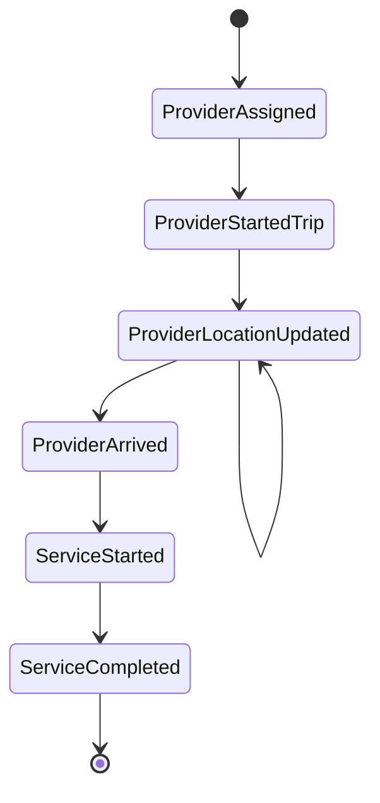
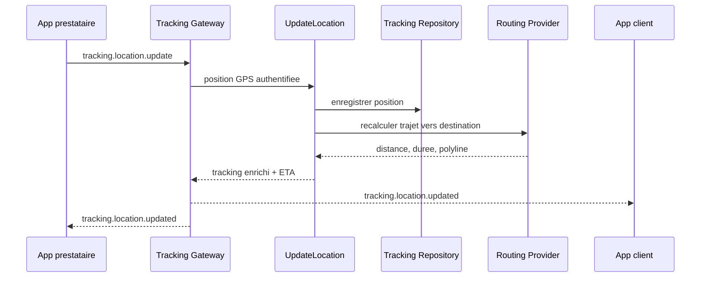

# Architecture cartographie et suivi temps reel

## Principes

- Le domaine ne connait ni Google Maps, ni HTTP, ni Socket.IO.
- `GeolocationModule` traduit adresse et coordonnees via `GeocodingPort`.
- `RoutingModule` calcule les trajets via `RoutingProviderPort`.
- `MapsModule` expose uniquement la facade HTTP et la configuration publique.
- `LiveTrackingModule` porte le cycle de mission et publie les Domain Events.
- Angular et le futur client Flutter consomment les memes DTO HTTP et Socket.IO.

## Structure backend

```text
src/
  maps/
    domain/
      models/
      value-objects/
    application/
    infrastructure/google/
    presentation/
  geolocation/
    application/ports/
    application/use-cases/
    infrastructure/
  routing/
    application/ports/
    application/use-cases/
    infrastructure/
  live-tracking/
    domain/entities/
    domain/events/
    application/ports/
    application/services/
    infrastructure/repositories/
    presentation/controllers/
    presentation/gateways/
```

## Responsabilites

| Couche | Responsabilite |
| --- | --- |
| Domain | Coordonnees valides, etat de mission, invariants et evenements |
| Application | Orchestration des cas d'usage, autorisations et ports |
| Infrastructure | Google Geocoding, Google Routes, Prisma et fournisseurs externes |
| Presentation | Validation DTO, HTTP, authentification et Socket.IO |

## Cas d'usage

- `GeocodeAddressUseCase`
- `ReverseGeocodeUseCase`
- `ComputeRoutesUseCase`
- `LiveTrackingCommandService.markOnTheWay`
- `LiveTrackingCommandService.updateLocation`
- `LiveTrackingQueryService.getReservationTracking`
- `TrackingRouteEstimatorService.enrich`

## Cycle de mission



## Flux temps reel



## Contrats Socket.IO

### Client vers serveur

```ts
type TrackingSubscribe = { reservationId: string };

type TrackingLocationUpdate = {
  reservationId: string;
  latitude: number;
  longitude: number;
  accuracyMeters?: number;
  headingDegrees?: number;
  speedKmh?: number;
  locationLabel?: string;
};
```

Evenements entrants:

- `tracking.subscribe`
- `tracking.unsubscribe`
- `tracking.location.update`
- `professional.presence.subscribe`

Evenements sortants:

- `tracking.snapshot`
- `tracking.location.updated`
- `tracking.mission.updated`
- `professional.presence.snapshot`
- `professional.presence.updated`

## Contrat d'itineraire partage Web et Flutter

```ts
type TrackingRoute = {
  distanceRemainingMeters: number;
  durationRemainingSeconds: number;
  estimatedArrivalAt: string;
  encodedPolyline: string;
  coordinates: Array<{
    latitude: number;
    longitude: number;
  }>;
};
```

Le mobile Flutter ne doit jamais appeler Google Routes directement. Il envoie
la position au backend et affiche le contrat neutre retourne par Jokko.

## Structure Angular

```text
src/app/
  shared/maps/
    google-maps-loader.service.ts
  features/tracking/
    data-access/
      provider-location.service.ts
      tracking-realtime.service.ts
    state/
      tracking.store.ts
  features/appointments/
    domain/
    data-access/
    presentation/
```

Les composants affichent l'etat. Les appels HTTP, Socket.IO, GPS et Google Maps
restent dans les services specialises.

## Strategie de montee en charge

1. Utiliser Redis adapter pour partager les rooms Socket.IO entre instances.
2. Limiter l'envoi GPS a 5-10 secondes et ignorer les deplacements insignifiants.
3. Stocker la derniere position en Redis avec TTL et conserver l'historique utile dans PostgreSQL/PostGIS.
4. Mettre en cache geocodage et routes courtes avec une cle basee sur des coordonnees arrondies.
5. Recalculer l'itineraire seulement apres un seuil de distance ou de temps.
6. Traiter les Domain Events via l'outbox existante pour garantir la reprise.
7. Separer plus tard le tracking en service autonome sans changer les ports metier.
8. Superviser latence Socket.IO, taux d'erreur Google, cout par itineraire et fraicheur GPS.

## Securite

- JWT obligatoire pour les routes privees et la connexion Socket.IO.
- Verification que l'utilisateur appartient a la reservation avant de rejoindre une room.
- Cle serveur Google limitee aux API Geocoding et Routes.
- Cle navigateur restreinte aux domaines autorises et aux API Maps JavaScript/Places.
- Aucun secret Google dans le bundle Angular.
- En production, `GOOGLE_MAPS_BROWSER_API_KEY` est obligatoire. La cle
  `GOOGLE_MAPS_API_KEY` n'est jamais renvoyee au navigateur.
- `GOOGLE_MAPS_MAP_ID` identifie le style de carte utilise par les marqueurs
  avances. `DEMO_MAP_ID` est uniquement le repli local de developpement.
